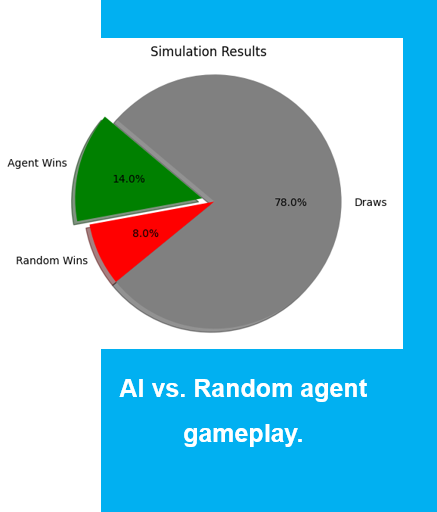
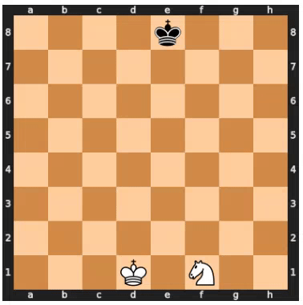
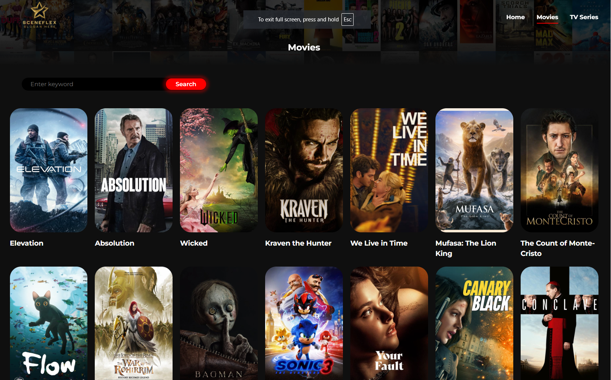
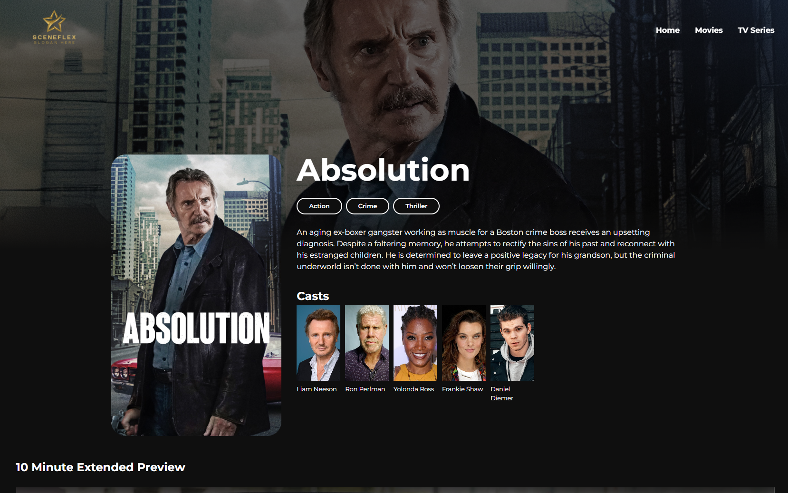

# Data Function Inc.

Welcome to the official GitHub profile of **Data Function Inc.**, where we showcase our open-source projects and contributions. We specialize in **Data Science**, **Data Analytics**, **AI**, and **Software Development**.

## Projects

Explore our featured projects categorized below to see how Data Function Inc. can make a difference:

#### Data Science

- **Object Detection and Recognition**

  1. [YOLOv3 Object Detection](https://github.com/DataFunctionInc/object-detection--nd-recognition.git)
     A python-based object detection built using the YOLOv3 deep learning model. This project processes images and videos, identifying objects and saving the results in a designated folder. It includes:

  - **Image and Video Processing**: Detect objects in static images and real-time video frames.
  - **Customizable Thresholds**: Configurable IoU and confidence thresholds for more accurate detections.
  - **Real-Time Processing**: Supports both batch image detection and real-time video processing.
    

        
        
        

    

    

    
    

- **Natural Lanuage Processing**

  - A cutting-edge object detection model built using YOLOv5.
  - [Project Link](#)
  - 

- **Forecasting (time series analysis)**

  - A cutting-edge object detection model built using YOLOv5.
  - [Project Link](#)
  - 

- **Prediction modelling**

  - A cutting-edge object detection model built using YOLOv5.
  - [Project Link](#)
  - 

- **Reinforcement learning**

  1. [♟️Chess Engine: AI Mastery with Reinforcement Learning](https://github.com/DataFunctionInc/chess-engine.git)

     Build an AI chess engine that learns strategies through **self-play** and **reinforcement learning**.

     - Learns chess from scratch using **Q-learning**.
     - Adapts strategies with a neural network for smarter gameplay.
     - Visualizes decision-making in real time.
     - Tools and Technology: Python, PyTorch, python-chess,Deep Q-Learning and visualization libraries.
       

       
       
       

     

     
     
     
     
     
     
     
     
       
     
     
     
     
     
       
     

     - Visuals of the agent playing the game:
     

      
     

#### Data Analytics

Our team has extensive experience in the following tools and services:

1. [Power BI](#power-bi-projects): We build interactive dashboards and reports that help businesses visualize and track their performance metrics in real-time.
2. [Tableau Projects](#tableau-projects): Our Tableau dashboards provide powerful insights with dynamic filters, visuals, and easy-to-digest reports.
3. [Excel Projects](#excel-projects): From financial modeling to data cleaning and forecasting, we use Excel's advanced features for in-depth data analysis.

- ##### Power BI Projects

  - **Sales Dashboard**

    - Description: A Power BI dashboard displaying sales performance metrics.
    <!-- - Features: Interactive charts, filters for regions and time periods, and monthly growth analysis.
    - [View Project](link-to-project)
    - Screenshot:  -->

  - **Employee Performance Tracker**
    - Description: Power BI report to track employee performance using various KPIs.
    <!-- - Features: Visuals like bar charts, scatter plots, and trend lines to visualize employee data over time.
    - [View Project](link-to-project)
    - Screenshot:  -->

- ##### Tableau Projects

  - **Market Analysis Dashboard**

    - I will add description here
      <!-- Description: A comprehensive Tableau dashboard analyzing market trends and customer behavior. -->
      <!-- - Features: Interactive filters, line and bar charts, geographic map visualizations.
    - [View Project](link-to-project)
    - Screenshot:  -->

  - **Financial Summary Report**
    - I will add description here
    <!-- - Description: A Tableau workbook summarizing financial data for decision-makers.
    - Features: Drill-down options, financial trend analysis, revenue breakdown by department.
    - [View Project](link-to-project)
    - Screenshot:  -->

- ##### Excel Projects

  - **Sales Forecasting Model**

    - I will add description here
    <!-- - Description: An Excel model that uses historical sales data to forecast future trends.
    - Features: Use of functions like **IF**, **VLOOKUP**, and **FORECAST** to predict sales.
    - [View Project](link-to-project)
    - Screenshot:  -->

  - **Data Cleaning and Transformation**
    - Description: A collection of Excel tools and macros to clean and transform raw data into usable formats.
    - Features: Data normalization, removal of duplicates, and advanced pivot table usage.
    - [View Project](link-to-project)
    - Screenshot: 

#### Frontend Development

Our team has extensive experience in web application frontends using the following set of technologies:

1. [React JS](#react-js-projects): We create robust web applications with dynamic UIs, including dashboards, applications, and tools for real-time data visualization and management.
<!-- 2. [Angular Projects](#angular-projects): Angular helps us develop feature-rich, scalable applications tailored for enterprise solutions.
2. [Vue.js Projects](#vue-js-projects): We leverage Vue.js to build lightweight, efficient, and high-performance single-page applications (SPAs). -->

---

- #### React JS Projects

  1. [SceneFlex](https://github.com/DataFunctionInc/sceneflex.git)
     A movie application that allows users to browse, search, and view movie details with a user-friendly interface.
     - **Features**:
       Dynamic Movie Browsing: Explore movies by genre, popularity, and search for specific titles.
       Detailed Movie Information: Access movie details such as cast, release date, runtime, trailers, and more.
       Responsive UI: Fully responsive design optimized for various devices.
       API Integration: Fetches real-time movie data using TMDb's powerful API.
     - **Preview**:
     

     
     
     
     
       
     
      

      <!--   
       -->

---

<!-- #### Angular Projects

- **Inventory Management System**
  - **Description**: A comprehensive inventory management tool designed for businesses to track stock and sales.
  - **Features**:
    - Role-based access.
    - Real-time stock updates.
    - Interactive charts for sales insights.

--- -->

<!--

## Contact
Feel free to reach out to me for collaboration, feedback, or inquiries about any of these projects!
- [LinkedIn](https://linkedin.com/in/your-profile)
- [Email](mailto:youremail@example.com) -->

<!--
- **Power BI Dashboard**
  - A comprehensive Power BI dashboard analyzing company sales data.
  - [Project Link](#)
  - Visuals: 

### Frontend

- **React-based Cineplex App**
  - A movie theater app built with React and Redux.
  - [Project Link](#)
  - Demo: [Cineplex Demo](#)

### Backend

- **Django REST API**
  - REST API developed using Django for a movie booking system.
  - [Project Link](#)
  - Demo: [API Documentation](#)

### Mobile App Development

- **React Native App**
  - A cross-platform mobile app built with React Native.
  - [Project Link](#)
  - Demo: [App Demo](#)

## 🔗 Links

- [Data Function Inc. Website](https://www.datafunction.ca)
- [Dawood's Data Science Portfolio](#)

## 🤝 Contribute

We welcome contributions to our projects! Check out our **issues** for open tasks and feel free to submit your pull requests. -->
